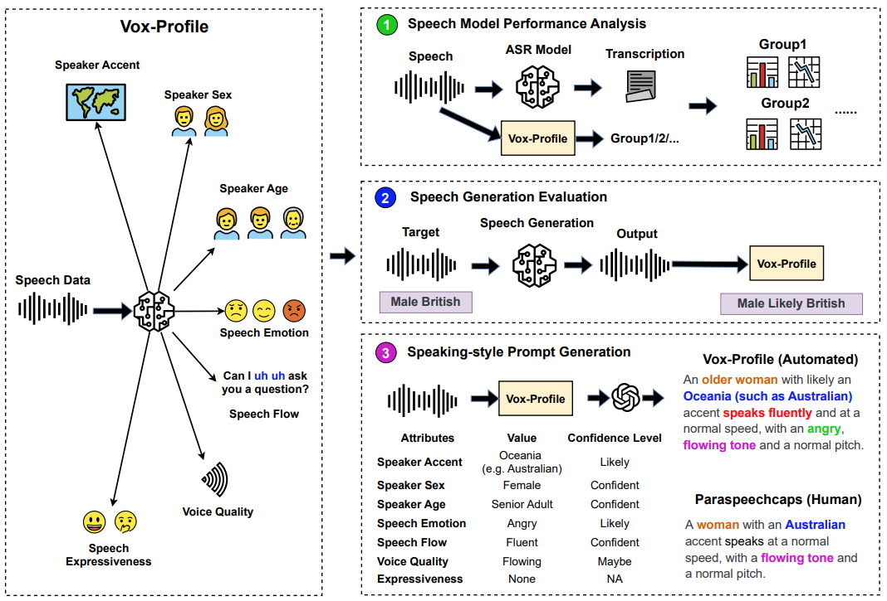
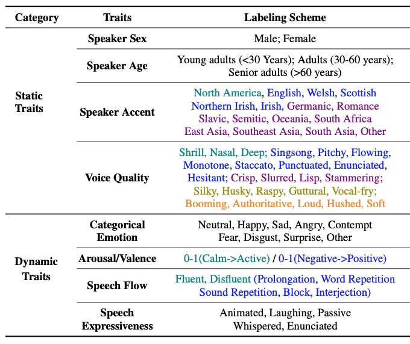
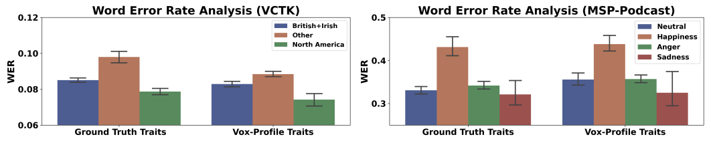
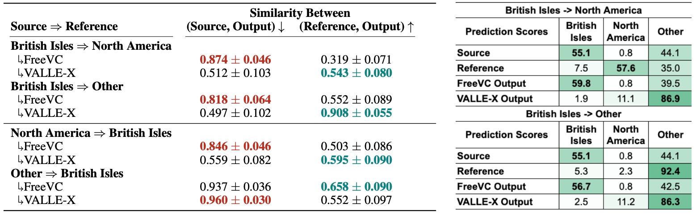
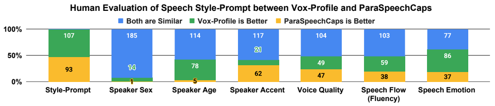

## Vox-Profile: A Speech Foundation Model Benchmark for Characterizing Diverse Speaker and Speech Traits

#### In this repo, we present Vox-Profile [[Paper Link](https://arxiv.org/pdf/2505.14648)], one of the first benchmarking efforts that systematically evaluate rich multi-dimensional speaker and speech traits from English-speaking voices. Our benchmark is presented below:

 

In Vox-Profile, we experiments with over 15 publicly available datasets to predict static traits (speaker age, speaker sex, speaker accent, and voice quality) and dynamic traits (speech emotion, speech flow, and speech expressiveness) in different recording conditions and elicitation settings (e.g., read, spontaneous, and conversational speech). Our labeling taxonomy is described below:

 

#### Quick start example:

The example is under src/example/broad_accent_wavlm.py
Simply replace the model path with the model weights provided. The availabel labels are ['British Isles', 'North America', 'Other'].

#### Given that the Vox-Profile Benchmark paper is still under peer-review, we provide limited set of models and model weights before the review is concluded. But below are the models we currently put out.

 Model Name  | Data  | Pre-trained Model | Use LoRa |  LoRa Rank Size  | Output | Example Code |
|--------------------------------------------------------|-------|-----------------|-----------------|-------------|------------------------|------------------------|
| [wavlm-large-sex-age](https://drive.google.com/drive/folders/1PQwQVXNg_RKK9AN6wHO4TB4AIhxY_1i4?usp=sharing)   | CommonVoice+Timit+Voxceleb (age enriched) | wavlm-large              | Yes              | 16              | Sex (2-class) / Age (0-1)*100 Years  | [Example](https://github.com/tiantiaf0627/vox-profile-release/blob/main/src/example/age_sex_wavlm.py) |
| [wavlm-large-broader-accent](https://drive.google.com/drive/folders/1v2_uUQ-q_CJ2vgtVNLiiwgWvCcEJDiRw?usp=sharing)   | See Paper (11 Datasets) | wavlm-large              | Yes              | 16              | North American / British / Other (3-class)  | [Example](https://github.com/tiantiaf0627/vox-profile-release/blob/main/src/example/broad_accent_wavlm.py) |
| [wavlm-large-narrow-accent](https://drive.google.com/drive/folders/12Mpn7aGj3ig8gvjiYTxUpXaNDISWoXOd?usp=sharing)   | See Paper (11 Datasets) | wavlm-large              | Yes              | 16              | See example  | [Example](https://github.com/tiantiaf0627/vox-profile-release/blob/main/src/example/narrow_accent_wavlm.py) |
| [wavlm-large-voice-quality](https://drive.google.com/drive/folders/1kqenJz58Ws_vU9GZuscuJ9u9kHXcTtKn?usp=sharing)   | ParaSpeechCaps | wavlm-large              | Yes              | 16              | See example  | [Example](https://github.com/tiantiaf0627/vox-profile-release/blob/main/src/example/voice_quality_wavlm.py) |
| [wavlm-large-influency](https://drive.google.com/drive/folders/1AQT-o3XIqXvJ34j5n6j6BOEslMan-yQ3?usp=sharing)   | SEP28K+FluencyBank | wavlm-large              | Yes              | 16              | Fluent/Disfluent (Specified Disfluency Types)  | [Example](https://github.com/tiantiaf0627/vox-profile-release/blob/main/src/example/fluency_wavlm.py) |
| [wavlm-large-categorical-emotion]()   | MSP-Podcast | wavlm-large              | Yes              | 16              | 8 Emotions + Other  | [Example](https://github.com/tiantiaf0627/vox-profile-release/blob/main/src/example/categorized_emotion_wavlm.py) |

### Enabling Versatile Speech Applications with Vox-Profile

Our Vox-Profile can be used as a fundamental component to support a versatile speech applications.

#### 1. Speech Model Performance Analysis

We generate speaker and speech traits for existing datasets and investigate whether these generated labels can lead to the same insights as using the ground truth trait information in analyzing the speech model performances. For example, in the results below, we identify that regardless of grouping by groud truth traits or traits inferred by Vox-Profile, the ASR performance trends remain the same across different traits.

 

#### 2. Automated Evaluation Tool for Speech Generation Tasks

We demonstrate the utility of Vox-Profile as an evaluation tool for speech generation tasks by comparing two representative models: FreeVC and VALLE-X. As shown in Table below, the accent prediction scores and the cosine similarity for the synthesized samples from FreeVC suggest greater similarity to the source speaker’s accent than to the reference speaker. In contrast, the scores for VALLE-X indicate closer alignment with the reference speaker’s accent in most conditions. These findings are consistent with previous studies, which report that FreeVC has limited capability in replicating the accentual features of the reference speaker compare to VALLE-X.

 

#### 3. Generating Synthetic Speaking Style Prompt
Vox-Profile provides a more extensive and varied set of traits, including speech flow, arousal, valence, and speaker age. Moreover, computational models of Vox-Profile output probabilistic predictions for each trait, enabling more nuanced and confidence sensitive descriptions. For example, a Scottish accent prediction with a probability of 0.9 can be described as having a distinct Scottish accent.

 

Human-evaluation results comparing synthetic speaking style prompts from Vox-Profile and human-annotated speaking style prompts from ParaSpeechCaps suggest that this group of human raters shows similar preference levels for both synthetic and human-annotated speaking style prompts. Specifically, they favor the emotion, age, and speech flow descriptions generated by Vox-Profile over those from ParaSpeechCaps.
